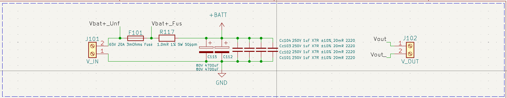
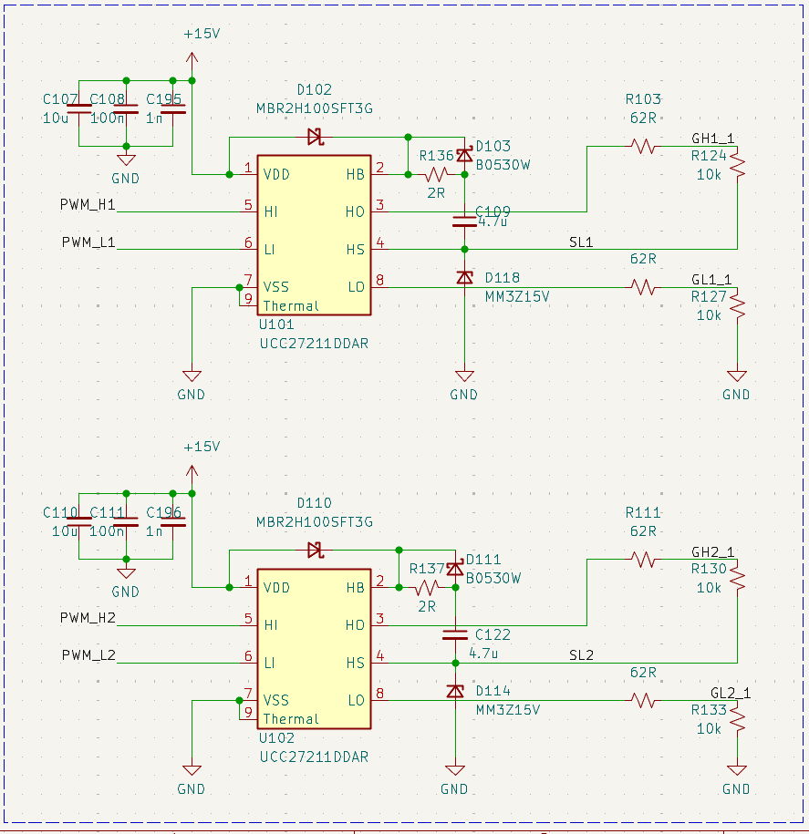
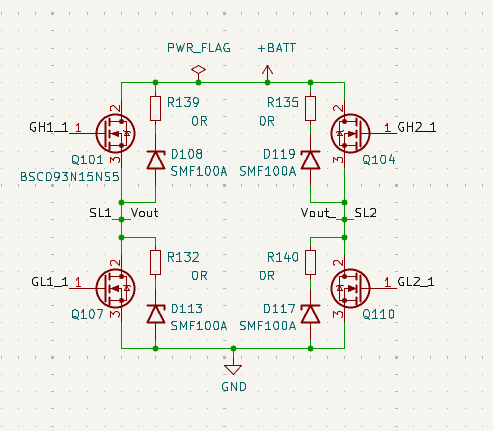
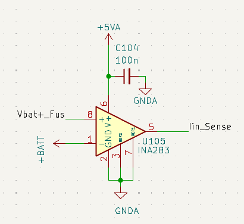
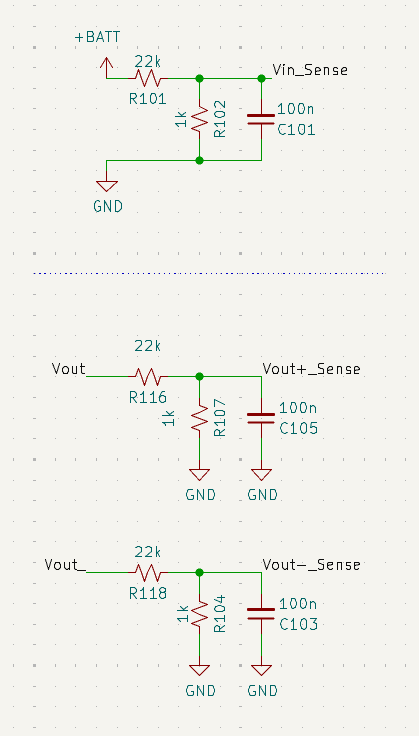

# Sistema de Direção Elétrica para Barco Solar

## Visão Geral do Sistema

O sistema de direção elétrica do barco solar é composto por duas placas interligadas: uma de controle e outra de potência.

### 1. Placa de Controle

* **Processador:** STM32L431
* **Comunicação:** Rede CAN a 500 kbit/s
* **Interfaces:**

  * Conector CAN (também fornece 18 V para alimentação)
  * UART / ST-LINK para programação e depuração
  * Conector para sensor de posição do leme (potenciômetro)
  * Conectores para encoder e fim de curso (redundância)

### 2. Placa de Potência

* **Topologia:** Ponte H (full-bridge) com dois drivers UCC27211DDAR e quatro MOSFETs BSC093N15NS5
* **Sensoriamento:**

  * Corrente: shunt de 1 mΩ + amplificador de instrumentação (INA283)
  * Tensão: divisor resistivo com filtro passa-baixa de 40 Hz
* **Conectores:**

  * Alimentação principal via KRE (baterias chumbo-ácido 10–15 V ou lítio até 60 V)
  * Saída para motor CIM (modelo FR801‑001)
* **Dissipação térmica:**

  * 5 vias de cobre (Ø 0,7 mm) por MOSFET
  * Thermal pad de 1 mm de espessura e 1 cm² por MOSFET
  * Dissipador montado entre as placas

---

## Fluxo de Sinal e Potência

1. **Entrada de Comando:**
   A placa MIC mede a posição do volante e transmite via CAN o setpoint da posição do leme.

2. **Leitura e Controle:**
   O STM32L431 recebe o comando via CAN, valida o ID e envia o setpoint ao controlador PID (utilizando apenas ganho proporcional) que ajusta o PWM dos drivers.

3. **Ponte H:**
   Os drivers UCC27211 acionam os MOSFETs BSC093N15NS5 conforme o PWM gerado. O sensor de corrente monitora o consumo para proteção.

4. **Motor e Feedback:**
   O motor CIM movimenta o leme, cuja posição é retroalimentada via um potenciômetro de 10 kΩ acoplado ao eixo e lido pelo ADC do STM32L431.

5. **Proteções e Limites:**

   * Monitoramento de corrente via shunt
   * Faixa de tensão: 10 V a 60 V
   * Corrente contínua máxima: 42 A (com eixo travado)
   * Corrente média operacional: 20–30 A
   * Picos de até 80 A
   * Potência média máxima: 450 W
   * Dissipador alcançou 60 °C após 1 min em teste de manobra extrema (condição não usual)

---

## Etapas da Placa de Potência

### Entrada

* Conector KRE de alimentação (bateria principal)
* Fusível de 20 A
* Shunt de 1 mΩ para medição de corrente
* Filtros:

  * 2 × 470 µF eletrolíticos
  * 4 × 1 µF cerâmicos para redução de ripple e compensação de indutâncias parasitas

---

### Drivers

* 2 × UCC27211DDAR (meia ponte, tecnologia bootstrap)
* Acionamento complementar com limitação de corrente de gate por resistores de 62 Ω
* Resistores de 10 kΩ entre gate e source para evitar operação na região linear em alta impedância
* Proteções adicionais conforme [SLUA887A](https://www.ti.com/lit/an/slua887a/slua887a.pdf):

  * 2 diodos para proteção
  * Resistor de 2 Ω para limitar corrente de bootstrap

---

### MOSFETs

* 4 × BSC093N15NS5 (150 V, 87 A, RDS(on) = 9,3 mΩ)
* Proteção por snubber com TVS de 111 V (breakdown), 160 V (clamping)
* Estratégia de chaveamento:

  * Um braço da ponte permanece fixo (conduzindo), o outro chaveia
  * O braço fixo alterna de acordo com o sentido do motor para garantir que o MOSFET inferior conduza, preservando a carga do bootstrap

---

### Sensor de Corrente

* Shunt de 1 mΩ + amplificador INA283 (ganho de 50 V/V)
* Saturação a 3,3 V → Corrente máxima medida ≈ 66 A

---

### Sensor de Tensão

* Divisor resistivo para adequar até 60 V para 2,6 V
* Filtro passa-baixa de 100 nF a 40 Hz
* Margem contra saturação do ADC e interferência do zener de proteção (3,3 V)

---

## Placa de Controle

* Alimentação lógica e dos drivers por 18 V da rede CAN
* Comunicação CAN conforme padrão do barco solar
* MCU STM32L431:

  * Leitura de posição do leme (potenciômetro via ADC)
  * Implementação do controle proporcional
  * Geração do PWM de controle para os drivers

---

## Testes

Foi realizado um teste com o volante indo de limite a limite a velocidade constante:

* O motor leva cerca de 1 s para atingir o extremo oposto
* Na reversão, consome cerca de 40 A por 500 ms
* Corrente estabiliza em torno de 11 A após aceleração
* Temperatura do dissipador atingiu 60 °C após 2 min de teste contínuo

Aqui está a continuação do relatório, agora com a **estimativa da indutância do motor** inserida ao final, mantendo o mesmo estilo e formatação:

## Estimativa da Indutância do Motor

Para estimar a indutância do motor, utilizamos o ripple de corrente observado em regime permanente com o motor em velocidade constante.

### Parâmetros do teste:

* Corrente média: **11 A**
* Ripple de corrente: **10%** → $\Delta I = 1{,}1\,\text{A}_{pp}$
* Tensão de alimentação: **36 V**
* Duty cycle: **40%**
* Frequência de PWM: **20 kHz** (→ período $T_s = 50\,\mu\text{s}$)
* Topologia: **Ponte H full-bridge com modulação bipolar**

### Modelo de cálculo:

Assumindo modulação bipolar, a variação de corrente durante o ciclo de comutação é dada por:

$$
\Delta I = \frac{2 \cdot V \cdot D \cdot T_s}{L}
\Rightarrow
L = \frac{2 \cdot V \cdot D \cdot T_s}{\Delta I}
$$

Substituindo os valores:

$$
L = \frac{2 \cdot 36\,\text{V} \cdot 0{,}4 \cdot 50 \times 10^{-6}\,\text{s}}{1{,}1\,\text{A}}
= \frac{1{,}44 \cdot 10^{-3}}{1{,}1}
\approx 1{,}31\,\text{mH}
$$

### Resultado:

A indutância estimada do motor é:

$$
\boxed{L \approx 1{,}31\;\text{mH}}
$$

